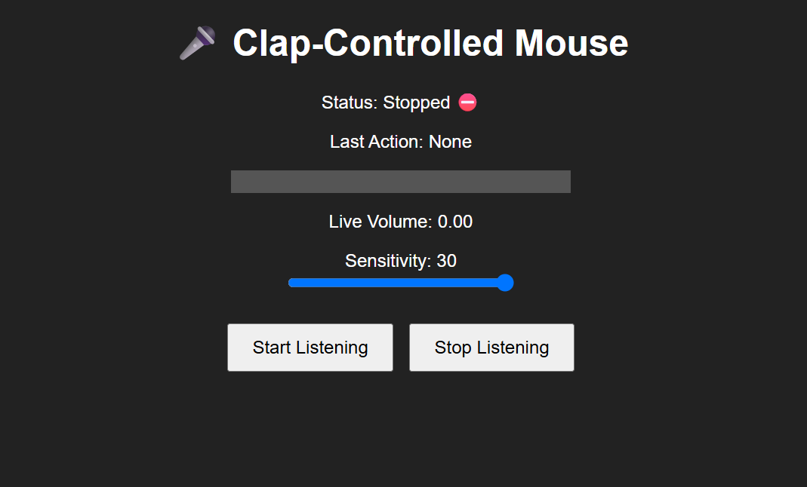
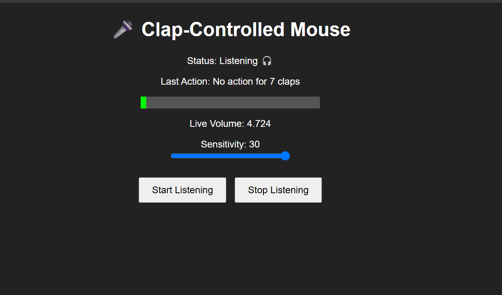

👏 Snap,Clap-Controlled Mouse 🎯
Basic Details
Team Name: Ohmzone

Team Members
Team Lead: Amal Joseph

Member 2: Benat Shaji

## Project Description
A fun and accessible Python + Flask application that allows you to control your computer's mouse using sound. By detecting claps with your microphone, the application translates these sounds into mouse actions like clicking and scrolling, providing a hands-free way to interact with your system.

## The Problem (that doesn't exist)
Are your hands tired from all that clicking and scrolling? Do you dream of a world where you can command your computer with a simple clap? Well, your dreams are now a reality! This project solves the totally non-existent problem of "mouse fatigue" with a pinch of fun and a dash of absurdity.

## The Solution (that nobody asked for)
We've developed a genius solution that uses your computer's microphone to listen for claps. One clap performs a left click, two claps scroll up, and three claps scroll down. It's the ultimate hands-free, clap-powered mouse control system that you never knew you needed.

## Technical Details
Technologies/Components Used
Languages used: Python, JavaScript

Frameworks used: Flask

Libraries used: sounddevice, numpy, pyautogui, gunicorn

Tools used: Git, GitHub, Render (for deployment)

## Implementation
### Installation:
just open the exe file!!!
Clone the repository: git clone [[Your Repository URL](https://github.com/AmalJose-ph)]

Navigate to the project directory: cd [[Your Project Name](https://github.com/AmalJose-ph/MouCo-struct)]

Install dependencies: pip install -r requirements.txt

### Run:

Run the Flask server: python app.py

Open your web browser and navigate to the address provided (e.g., http://127.0.0.1:5000)

## Project Documentation
### Screenshots (Add at least 3)

The initial state of the web dashboard, showing the "Stopped" status.

The dashboard while the app is listening, displaying the live volume meter and status.

!

Screenshot3
(Add screenshot 3 here with proper name) Add caption explaining what this shows

Diagrams
!

Workflow
(Add your workflow/architecture diagram here) Add caption explaining your workflow
